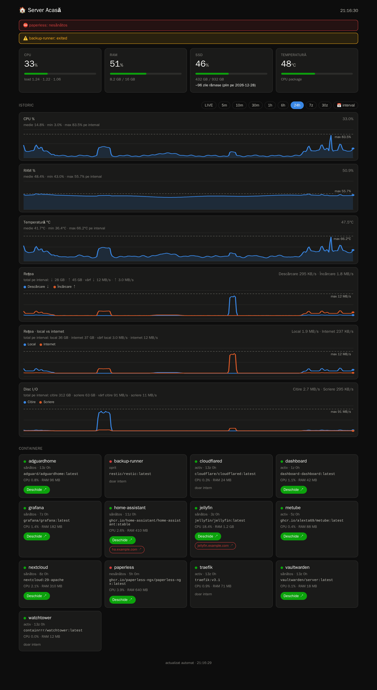
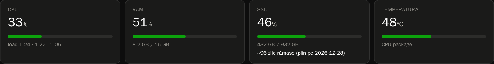
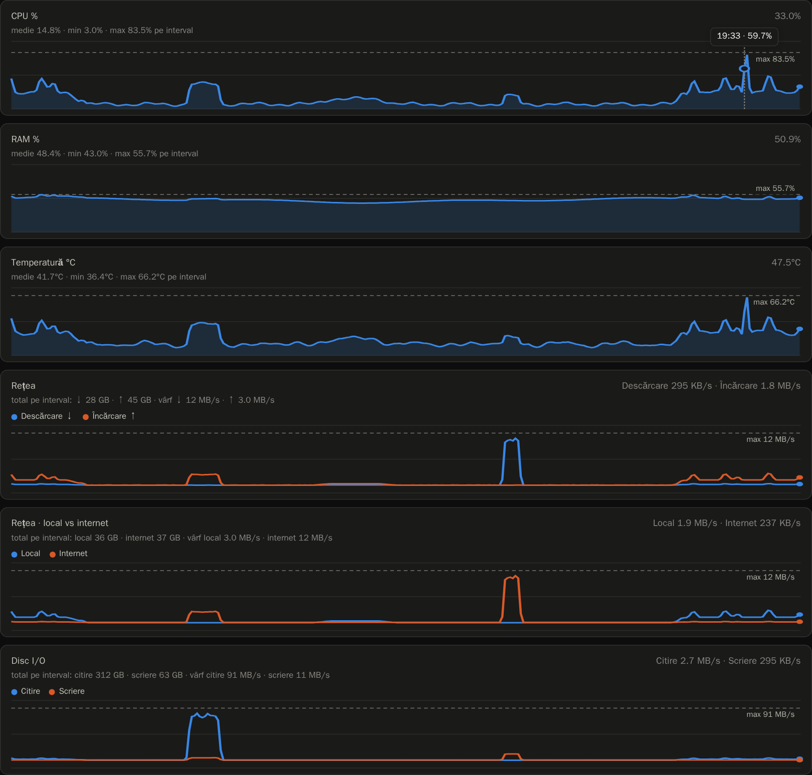
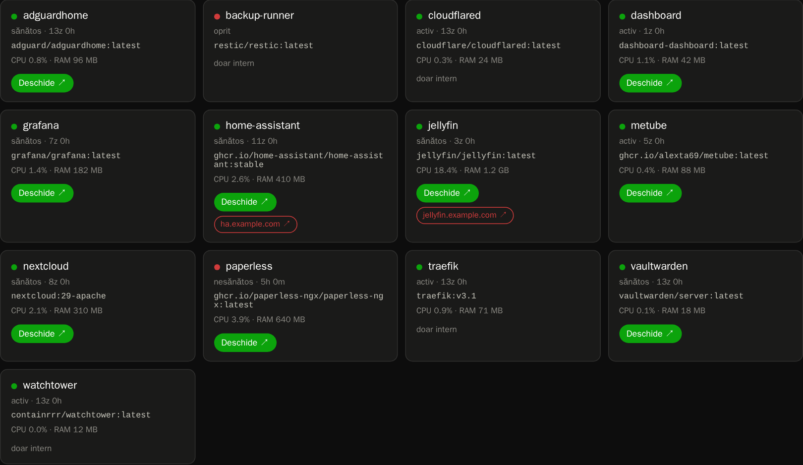
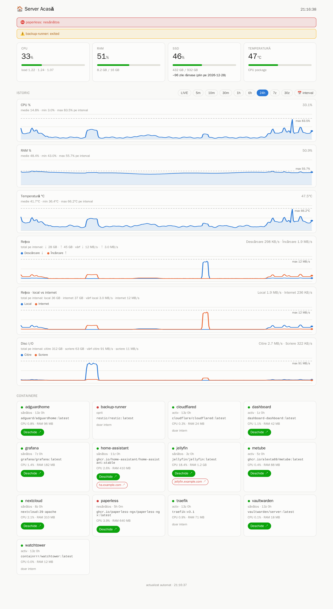
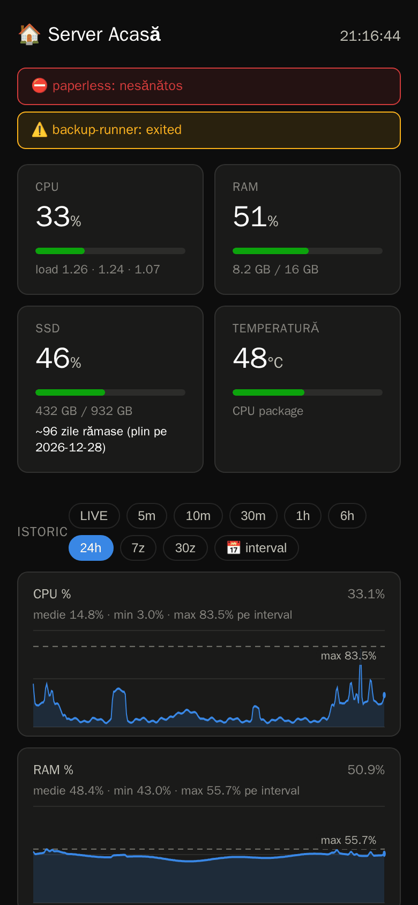

# dashboard

A single-file Flask dashboard for a homelab Docker host: live CPU / RAM / disk / temperature,
history charts with peaks, network split into LAN vs internet traffic, per-container stats and
auto-discovered links to your other containers.



> The UI text is in Romanian. All screenshots use generated demo data, not a real host - see
> [Regenerating the screenshots](#regenerating-the-screenshots).

## Features

### Live tiles and alerts

CPU, RAM, disk and CPU temperature, refreshed every 5 seconds. The disk tile shows a forecast of
how many days are left until the disk is full (least-squares trend, shown once there is at least a
day of history). Alerts appear when CPU, RAM or disk stay above 90% (or temperature above 80 °C)
for about a minute, and when a container is unhealthy or has stopped.



### History charts with peaks

Everything is sampled every 15 seconds into SQLite and kept for about five weeks. Pick a range
from LIVE (last 2 minutes) up to 30 days, or choose a custom interval. Each chart shows the
average / min / max for the range, a dashed line at the **peak** value, and a tooltip with exact
values on hover or touch.



Two network charts are included:

- **Rețea** - download / upload of the host's physical interfaces.
- **Rețea · local vs internet** - the same traffic split by where it went: to/from devices on your
  LAN, or to/from the public internet (see [Local vs internet traffic](#local-vs-internet-traffic)).

### Containers

Every container gets a card with its status, CPU, memory and uptime. Links are discovered from Traefik
`Host()` labels (or the first published port) and coloured by where they lead: **green** stays on
your LAN, **red** goes through a public domain.



### Light, dark and mobile

The layout follows the system colour scheme and is usable on a phone; a web manifest lets you
install it as an app.

| Light | Mobile (dark) |
| --- | --- |
|  |  |

## Requirements

- Docker + Docker Compose
- A `local-net` Docker network (see `compose.yml`) - create it with:
  ```
  docker network create local-net
  ```
- (Optional) Traefik on the same network if you want the `dashboard.home` routing label to work.

## Setup

1. Copy `.env.example` to `.env` and fill in your values:
   ```
   cp .env.example .env
   ```
   - `HOST_IP` - your Docker host's LAN IP. Used as a fallback link for containers that publish
     a port but have no Traefik `Host()` label.
   - `LAN_SUBNET` - your LAN subnet. It gates access through the Traefik `ipallowlist`
     middleware and defines what counts as "local" traffic in the LAN vs internet chart.

2. (Optional) Copy `overrides.example.json` to `data/overrides.json` to manually set or hide the
   link shown for specific containers (useful for host-network containers with no Traefik label):
   ```
   cp overrides.example.json data/overrides.json
   ```

3. Start it:
   ```
   docker compose up -d --build
   ```

The dashboard listens on port 5000 inside the container; expose it however you like (the included
Traefik labels route `dashboard.home`, restricted to `LAN_SUBNET`).

## Local vs internet traffic

The split is computed from the host's connection-tracking table (`/proc/1/net/nf_conntrack`),
sampled every 15 seconds. A flow counts as **internet** if either end is a public address, and as
**local** if both ends are inside `LAN_SUBNET`. Traffic between containers, and containers talking
to the host's own LAN address, never touches the network card and is ignored.

Linux does not keep per-flow byte counters by default, so enable them once on the host:

```
sudo sysctl -w net.netfilter.nf_conntrack_acct=1
# keep it after a reboot:
echo "net.netfilter.nf_conntrack_acct=1" | sudo tee /etc/sysctl.d/99-conntrack-acct.conf
```

Until that is set, the chart shows a hint instead of data and everything else works normally.
Only flows created after the setting is enabled are counted, and a flow that starts and ends
between two samples can be missed, so the two series are close to, but not exactly, the
download + upload of the first network chart. Peaks are the highest 15-second average, not
instantaneous spikes.

## Security notes

- The container mounts `/var/run/docker.sock` and the host's `/` and `/sys` (all read-only mounts,
  but a Docker socket still grants control of the Docker daemon). Only run this on a trusted LAN
  and keep the `ipallowlist` middleware; do not publish the dashboard to the internet.
- Keep credentials and real hostnames in `.env` / `data/`, both of which are git-ignored.

## Regenerating the screenshots

The images in `docs/screenshots/` come from [scripts/screenshots.py](scripts/screenshots.py), which
replaces every `/api/*` response in the browser with generated demo data, so nothing from a real
host ends up in them. With the dashboard running:

```
pip install playwright pillow && playwright install chromium
python scripts/screenshots.py http://localhost:5000 docs/screenshots
```

## Data

Runtime state (metrics history as SQLite, and `overrides.json`) lives in `./data`, bind-mounted
into the container - nothing is stored outside this project directory.

## License

MIT - see [LICENSE](LICENSE).
